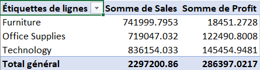
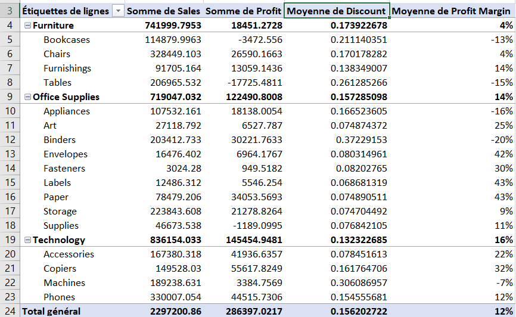
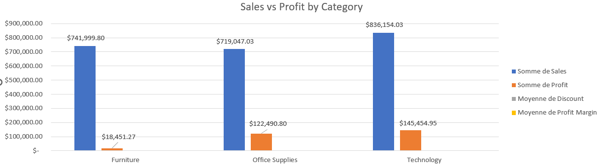
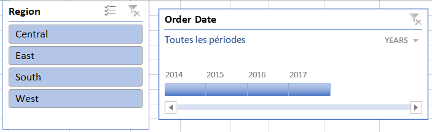
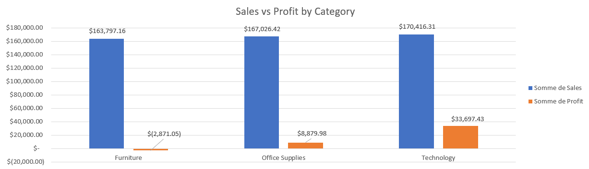
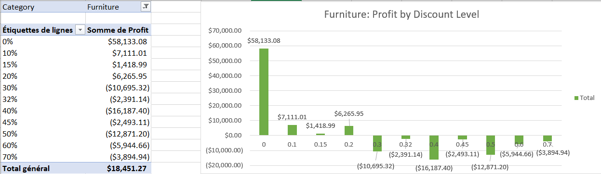
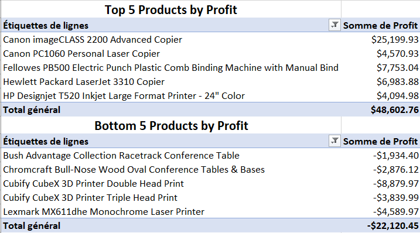

#  Superstore Sales & Profit Performance Analysis

##  Executive Summary
This project delivers an interactive data analysis of the Global Superstore dataset built with **Microsoft Excel** (Pivot Tables, Dynamic Pivot Charts, Slicers, and Timelines). The objective is to evaluate revenue against profit across product categories, analyze regional performance, and identify key business risks.

---

##  Dashboard Overview & Key Visuals

### 1. Base Summary Data (Pivot Table)
The core numbers behind our analysis showing total sales and total profit per category:



The Major Issue: Furniture generates a huge amount of revenue ($742K), but contributes almost nothing in profit (only $18.4K) compared to the other categories. Why is that? That's exactly what we'll uncover by analyzing the discounts.

### 2. Sub-Category Deep-Dive & Discount Audit
Detailed breakdown analyzing the impact of average discounts and margins on product sub-categories:



The analysis reveals a clear pattern: once the average discount exceeds 20%, sub-categories such as Tables, Bookcases, and Binders become unprofitable on average.

### 3. Global Performance by Category



Furniture: Despite generating the highest sales, the category delivers disproportionately low profit, indicating poor profitability.

Office Supplies & Technology: Both categories convert sales into profit much more effectively, demonstrating stronger and healthier profit performance.

### 4. Interactive Slicers & Dynamic Filtering



Let's filter the data to the Central region using the slicer. Is the Furniture category still profitable, or does its profit become negative?

### 5. Regional Deep-Dive (Central Region Alert)

Filtering by the **Central Region** exposes a major financial drain in the Furniture department:



Furniture records a negative profit of -$2,871.05, making it the only category operating at a loss in the Central region due to localized over-discounting.

Technology leads all categories with a profit of $33,697.43, making it the top-performing category in terms of profitability.

##  6. Discount & Profitability Analysis

An analysis of discount levels reveals the primary root cause of losses in the **Furniture** category:



* **0% – 20% Discount:** Products remain profitable, generating healthy margins.
* **> 20% Discount (Tipping Point):** Any discount exceeding **20%** causes immediate, significant financial losses (plunging to **-$10,695.32** at 30% discount).

>  Heavy discounting on Furniture items completely destroys product margins. 

##  7. Top vs. Bottom Product Performance
A deep dive into individual product profitability reveals extreme disparities:



High-ticket items like 3D printers and large conference tables suffer massive losses when paired with aggressive discounting (>20%). Conversely, copiers and office binding equipment represent our most lucrative lines.

---

##  Key Findings & Business Insights

| Category | Total Sales ($) | Total Profit ($) | Profit Margin (%) | Performance Status |
| :--- | :--- | :--- | :--- | :--- |
| **Technology** | $836,154.03 | $145,454.95 | **~17.4%** | 🟢 High Performer |
| **Office Supplies** | $719,047.03 | $122,490.80 | **~17.0%** | 🟢 Stable |
| **Furniture** | $741,999.80 | $18,451.27 | **~2.5%** | 🔴 At-Risk Category |

* **Low Margin Alert:** **Furniture** generates heavy sales volume ($741.9K) but delivers an exceptionally low return ($18.4K).
* **Regional Loss:** In the **Central Region**, Furniture incurs an absolute loss of **-$2,871.05** on $163.7K of sales, driven by unoptimized discount structures.
* **Top Profit Engine:** **Technology** is the primary driver of profitability, yielding $145.5K in profit.

---

##  Strategic Recommendations

Based on the quantitative findings from the Superstore dataset analysis, we recommend implementing the following **4 key business actions**:

### 1. 🛑 Enforce a Hard Cap on Discounts (>20%)
* **Problem:** Data proves that any discount over **20%** severely destroys profitability, resulting in net losses as deep as **-$16,187.40** (at 40% discount).
* **Action:** Restrict sales representative authorization for discounts. Any discount exceeding **15%** should require manager approval, with a **hard limit at 20% max**.

### 2. 🛋️ Restructure Furniture Category Pricing
* **Problem:** Heavy items like *Conference Tables* (e.g., Chromcraft & Bush Advantage lines) incur major losses due to combined high shipping costs and aggressive discounting.
* **Action:** Re-evaluate shipping fees for bulk furniture items and eliminate discount promotions on heavy office tables.

### 3. 🖨️ Audit High-Loss Technology Items
* **Problem:** Products like the *Cubify CubeX 3D Printers* generated massive losses exceeding **-$12,000** combined.
* **Action:** Review supplier pricing, warranty costs, or discontinue stocking non-performing items like 3D printers that suffer from high return/discount rates.

### 4. 📈 Double Down on Top Performers
* **Problem:** Office Copiers and Binding Machines generate exceptional profits (e.g., *Canon imageCLASS 2200* alone generated **+$25,199.93**).
* **Action:** Increase marketing spend and bundle promotions around high-margin technology assets (Copiers & Laserjet lines).

---

##  Repository Structure

```text
superstore-sales-profit-analysis/
├── data/
│   └── Superstore_Dataset.xlsx
├── dashboards/
│   └── Superstore_Dashboard.xlsx
├── screenshots/
│  ├── 01_pivot_table_sales_vs_profit.png
│   ├── 02_pivot_table_subcategory_deep_dive.png
│   ├── 03_sales_vs_profit_global_currency.png
│   ├── 04_slicers_region_and_timeline.png.png
│   ├── 05_sales_vs_profit_central_region.png.png
│   ├── 06_furniture_discount_analysis.png.png
│   └── 07_top_flop_products.png.png
└── README.md
